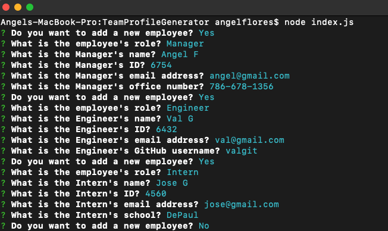
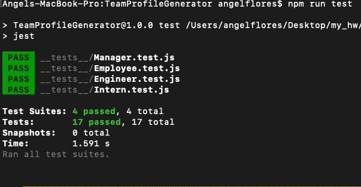

# Team Profile Generator

## Description
    This command line application generates a an HTML web file. This allows companies to save time
    by just answering a few questions about their new employees that are joining a new team. 
    This application deploys with NodeJS and was created using JavaScript, Inquirer package and 
    Jest for testing. 

## Test
    npm run test    

## Scenario
    - Run node index.js on the command line.
    - The user employer responds to the generated questions.
    - After the last question is answered, An html file is automatically created and saved.
    - The user opens the new file and it will open up on the main browser where the employer 
      will see that all the questions and information already generated inside of cards with
      the information of manager, intern or engineer. 
    - The employer saves time and can keep track of new employees and teams. 

## Video Demo

[Demo](https://drive.google.com/file/d/1ajfxU8c_X414Cgq8t0RSeqE0TsWf-DRI/view?usp=sharing)
Click "Demo" for video demo. 

## License

## Screenshots of README Generator Functionality

